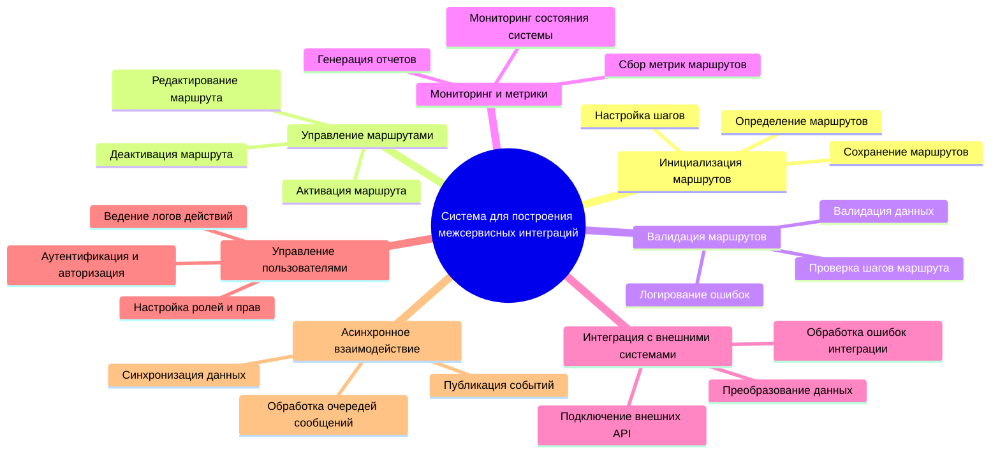
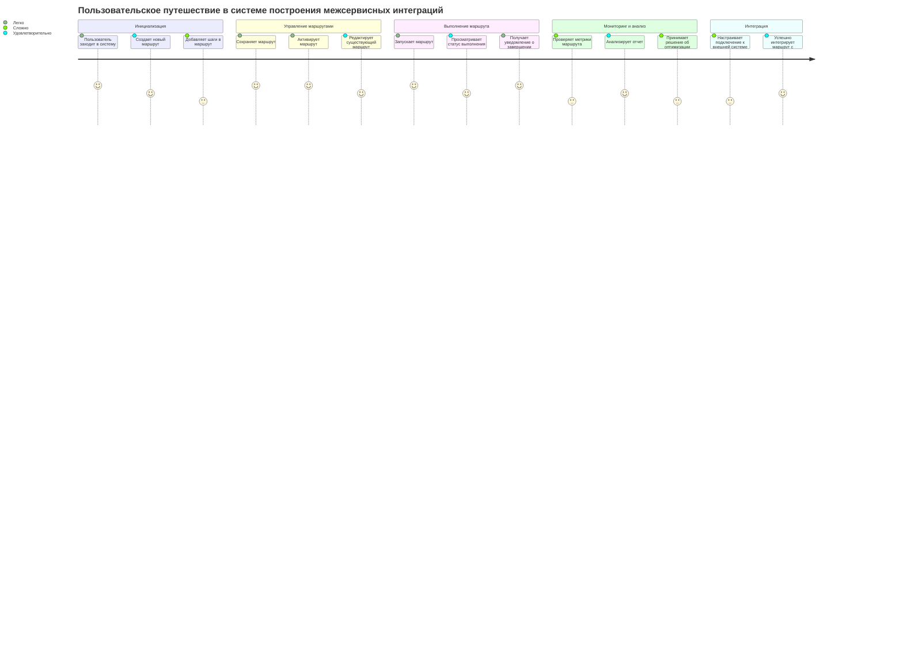
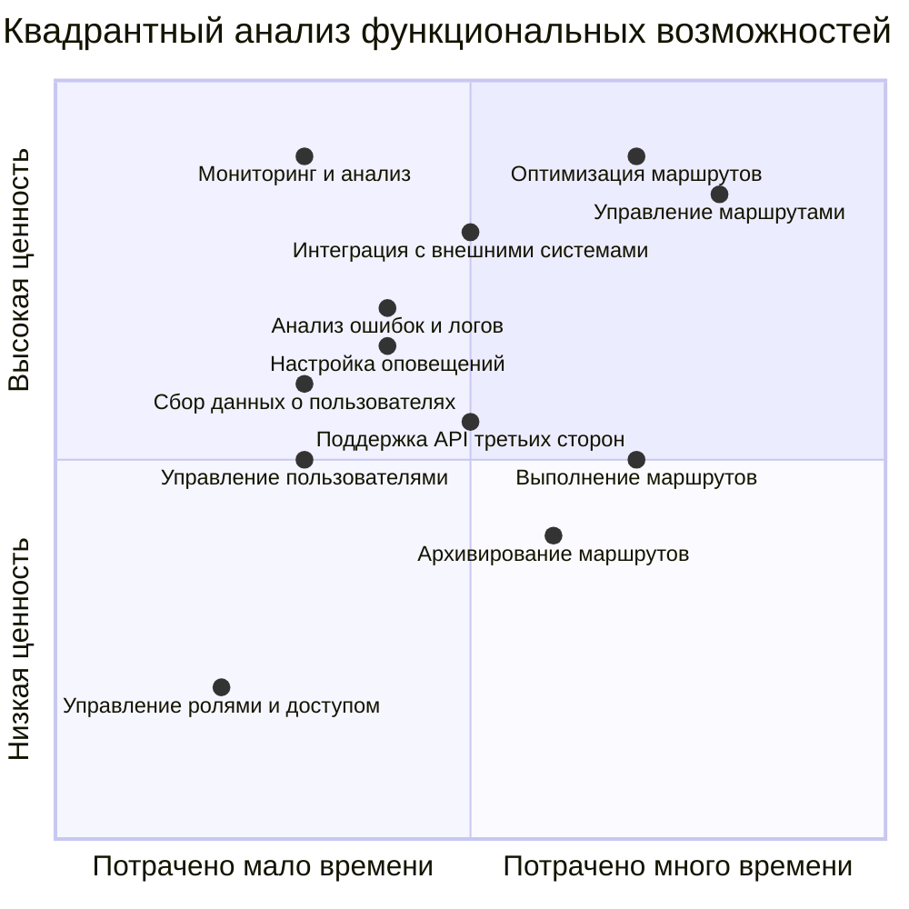
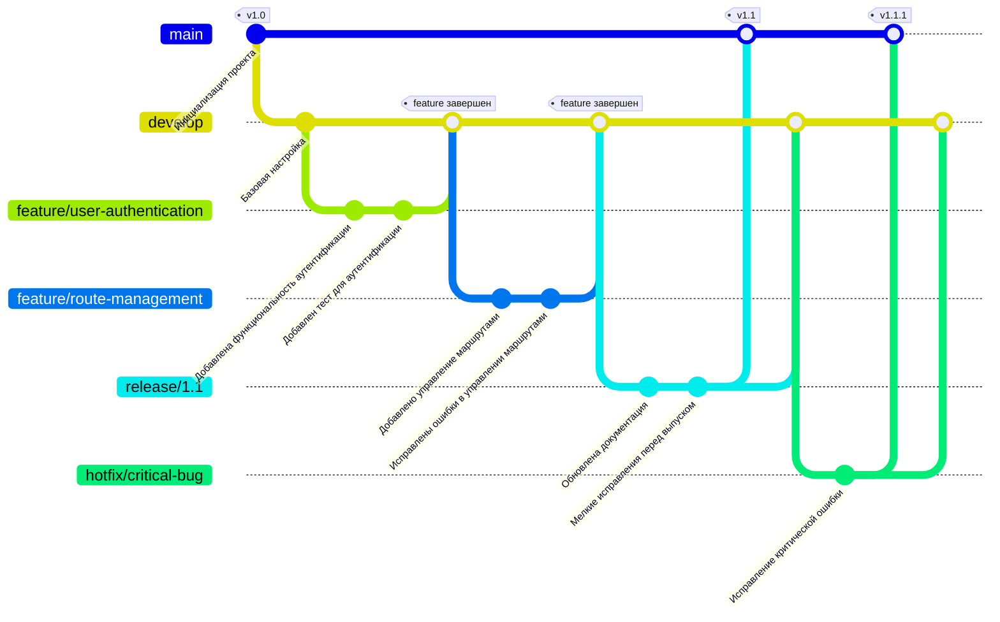

# Практическая работа №12

## Структура функциональных возможностей (Mind Map)

*Mind Map* диаграмма для проекта **"Low-code система для построения межсервисных интеграций"** представлена ниже.

В диаграмму включены основные разделы: инициализация маршрутов, управление ими, их валидация, мониторинг, интеграция с внешними системами, управление пользователями и асинхронное взаимодействие. Каждый раздел детализирован подфункциями, отображающими ключевые аспекты системы.

### Инициализация маршрутов

**Инициализация маршрутов** включает функциональность для создания новых маршрутов и настройки их шагов. Пользователи могут *определять маршруты*, задавая последовательность шагов, которые необходимо выполнить. Каждый шаг можно детализировать, указав входные данные, параметры обработки и условия завершения. *После настройки маршруты сохраняются* в системе для дальнейшего использования или редактирования.

### Управление маршрутами

Отвечает за управление существующими маршрутами. Пользователи могут активировать маршруты для запуска их выполнения или деактивировать их, чтобы остановить обработку. Также предусмотрена возможность редактирования маршрутов, включая изменение порядка шагов, их параметров или добавление новых шагов. Это позволяет поддерживать маршруты в актуальном состоянии.

### Валидация маршрутов

Валидация маршрутов обеспечивает проверку корректности конфигурации маршрутов перед их выполнением. Система анализирует последовательность шагов, проверяет их совместимость и валидирует входные данные. При обнаружении ошибок происходит их логирование с указанием деталей, что помогает пользователю исправить конфигурацию.

### Мониторинг и метрики

Этот функциональный блок собирает информацию о работе системы и маршрутов. Метрики включают данные о производительности, использовании ресурсов, состоянии маршрутов и их шагов. На основе этих данных система предоставляет возможности для мониторинга, визуализации состояния и генерации отчетов для анализа.

### Интеграция с внешними системами

Система позволяет подключаться к внешним API и другим системам для обмена данными. Предусмотрены функции преобразования данных в подходящий формат, а также обработка ошибок интеграции, включая повторные попытки при сбоях. Это обеспечивает стабильное взаимодействие с внешними сервисами.

### Управление пользователями

Функциональность управления пользователями включает аутентификацию и авторизацию для обеспечения безопасного доступа. Пользователи могут настраивать роли и права для разделения ответственности. Также ведется логирование действий пользователей, что помогает в аудите и анализе работы системы.

### Асинхронное взаимодействие

Для повышения производительности и масштабируемости система поддерживает асинхронное взаимодействие. Публикация событий позволяет уведомлять другие компоненты о происходящих изменениях. Очереди сообщений обрабатываются для распределения нагрузки, а синхронизация данных обеспечивает согласованность между различными частями системы.

## Диаграмма путешествия пользователя (User Journey Map)

Диаграмма пользовательского путешествия отражает ключевые этапы взаимодействия пользователя с системой управления маршрутами.

### Инициализация

Путешествие начинается с **инициализации**, где пользователь *создает новый маршрут* и *добавляет шаги*. На этом этапе трудности могут возникнуть при настройке сложных шагов из-за количества параметров, требующих внимания.

### Управление маршрутами

На этапе **управления маршрутами** пользователь *сохраняет и активирует маршруты*, а также может *редактировать* существующие.

### Выполнение маршрутов

В процессе **выполнения маршрутов** пользователь запускает маршруты и может *наблюдать за их статусом* через мониторинг. Завершение маршрута сопровождается уведомлением, что делает взаимодействие понятным и информативным.

### Мониторинг и анализ

На этапе **мониторинга и анализа** пользователь сталкивается с определенными трудностями при интерпретации метрик и отчетов, что требует дополнительных навыков. Анализ отчетов позволяет принимать *решения по оптимизации маршрутов*, что делает этот этап важным для долгосрочной эффективности.

### Интеграция

Этап **интеграции** включает настройку подключения к внешним системам и API. Этот процесс может быть сложным из-за *требований к форматам данных* и обработки ошибок.

## Квадрант-граф

Квадрантный анализ функциональных возможностей проекта:

### Описание

Данная диаграмма представляет квадрантный анализ функциональных возможностей системы, оценивая их по двум осям: затраты времени на реализацию (по горизонтали) и ценность для пользователей или бизнеса (по вертикали). 

*Функции с высокой ценностью и меньшими временными затратами*, такие как “Мониторинг и анализ”, “Оптимизация маршрутов” и “Управление маршрутами”, занимают верхние правые квадранты, что делает их приоритетными для реализации. Эти функции наиболее критичны для достижения бизнес-целей и улучшения пользовательского опыта.

*Функции с низкой ценностью*, такие как “Управление ролями и доступом” и “Архивирование маршрутов”, расположены в нижнем левом квадранте и могут быть реализованы позже или оптимизированы. Среднеценностные возможности, такие как “Сбор данных о пользователях”, “Настройка оповещений” и “Поддержка API третьих сторон”, находятся ближе к центру, что указывает на умеренные затраты времени и их относительную важность. 

> Диаграмма позволяет эффективно расставить приоритеты в разработке и определить, какие функции обеспечат максимальную ценность при минимальных затратах.

## Гит граф

Git-граф отражает процесс разработки приложения, показывая основные ветки, этапы работы и ключевые моменты интеграции.

Применена стратегия ветвления Git-Flow:

1. основные ветки:
	- main: содержит стабильные версии проекта;
	- develop: используется для интеграции новых функций и тестирования.
1. каждая новая функциональность разрабатывается в отдельной ветке, например, feature/user-authentication или feature/route-management;
2. перед выпуском версии создаётся release-ветка, например, release/1.1, для тестирования и финальных исправлений;
3. hotfix-ветки для критических исправлений, например, hotfix/critical-bug. Сразу вливаются в main и develop.
